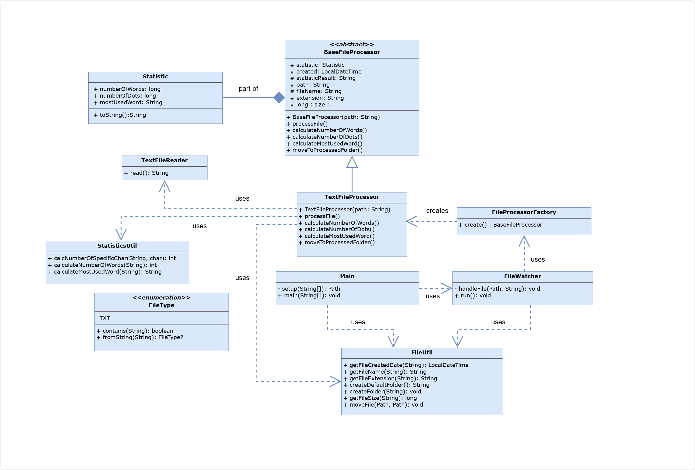

## HICX Second Interview Task

#### Generate Statistics of Files by Watching Folder

Requirements:

- [x]  Get directory path as an argument

- [x] Monitor files in given path

- [x] Generate statistic data and print it

- [x] Move processed files to "processed" sub folder

### How to run

#### clone the project: https://github.com/gurkanucar/hicx-case

```bash
  git clone https://github.com/gurkanucar/hicx-case
```

#### create jar

```bash
  cd hicx-case
  mvn clean install
```

#### run unit tests

```bash
  mvn test
```

#### run jar

```bash
  java -cp target/hicx-case-1.0-SNAPSHOT.jar org.gucardev.Main <YOUR_PATH>
```

path is optional, if you don't provide path it will listen automatically :
src/main/resources/watch_this_directory


#### ! Note that

jar file is available here: [hicx-case-1.0-SNAPSHOT.jar](https://github.com/gurkanucar/hicx-case/blob/main/build/hicx-case-1.0-SNAPSHOT.jar)


